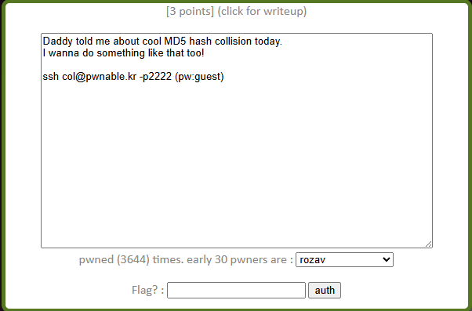
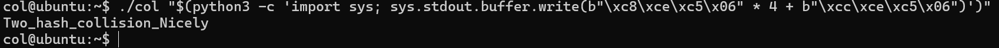

# pwnable.kr - col Writeup

This is the second challenge on pwnable.kr, and it's basically a quick lesson in how C handles memory allocation and pointer casting. It shows you exactly how easily a custom hash verification can be broken if you understand how data gets reinterpreted in memory.

## The Source Code

Here is the source code for the binary:

    #include <stdio.h>
    #include <string.h>
    unsigned long hashcode = 0x21DD09EC;
    unsigned long check_password(const char* p){
        int* ip = (int*)p;
        int i;
        int res=0;
        for(i=0; i<5; i++){
            res += ip[i];
        }
        return res;
    }

    int main(int argc, char* argv[], char* envp[]){
        if(argc<2){
            printf("usage : %s [passcode]\n", argv[0]);
            return 0;
        }
        if(strlen(argv[1]) != 20){
            printf("passcode length should be 20 bytes\n");
            return 0;
        }

        if(hashcode == check_password(argv[1])){
            system("/bin/cat flag");
            return 0;
        }
        else{
            printf("wrong passcode .\n");
            return 0;
        }
    }

## Breaking Down the Pointer Magic

Looking at the main function, our target is clear: we need the `check_password` function to return `0x21DD09EC`. But we have two main constraints to deal with:
1. Our input string must be exactly 20 bytes long.
2. We can't use null bytes (\x00) because `strlen` will think the string ended early, failing the length check.

The core of the challenge lies in this line inside `check_password`:

    int* ip = (int*)p;

The code takes our input pointer, which starts as a character pointer (`char*` where each element is 1 byte), and explicitly typecasts it into an integer pointer (`int*` where each element is 4 bytes). Because our input string is 20 bytes long, treating it as an array of 4-byte integers splits it into exactly 5 distinct integers (20 / 4 = 5). The loop then just sums these 5 integers up and saves them into `res`.

## Doing the Math

We need to come up with 5 integers that add up to `0x21DD09EC`. 

If we convert `0x21DD09EC` to decimal, we get 568134124. 
Dividing this by 5 gives us 113626824 with a remainder of 4.

So, we can keep things clean by using the baseline value four times, and adding the remainder to the fifth integer:
* Integers 1 to 4: 113626824 (which is 0x06C5CEC8)
* Integer 5: 113626824 + 4 = 113626828 (which is 0x06C5CECC)

### Dealing with Endianness

Since x86 architecture uses Little-Endian, the least significant bytes are stored first in memory. When we pass our payload through the command line, we have to reverse the byte order of our hex values:
* 0x06C5CEC8 becomes \xc8\xce\xc5\x06
* 0x06C5CECC becomes \xcc\xce\xc5\x06

Notice that none of these bytes are `\x00`, so `strlen` won't choke on them.

## Pounding the Binary

Now we just assemble the payload and pass it to the binary using a quick inline Python command:

    ./col $(python -c "print '\xc8\xce\xc5\x06'*4 + '\xcc\xce\xc5\x06'")

The program handles our 20-byte input, casts it, sums up the values to match the hashcode perfectly, and drops the flag.

