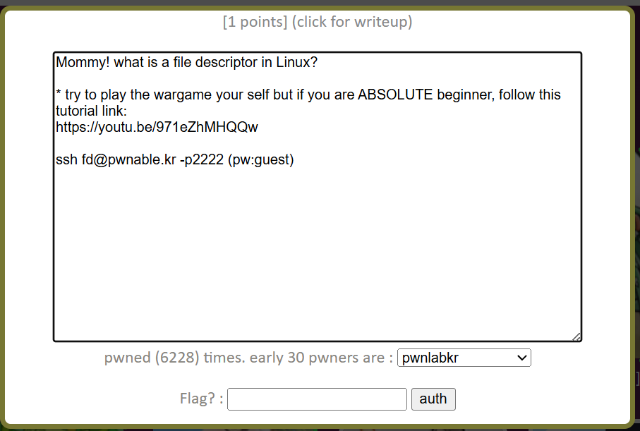

# Writeup: pwnable.kr - fd

האתגר "fd" הוא האתגר הבסיסי ביותר בפלטפורמת pwnable.kr, והוא נועד להקנות הבנה ראשונית של ניהול קבצים במערכות הפעלה מבוססות לינוקס. האתגר מתמקד במושג של File Descriptors (מתארי קבצים) וכיצד ניתן לתמרן אותם כדי להפנות את זרם הקלט של התוכנית.

## קוד המקור (fd.c)

הקוד הבא הוא קוד המקור של התוכנית הפגיעה כפי שהוא מופיע בשרת האתגר:

    #include <stdio.h>
    #include <stdlib.h>
    #include <string.h>
    char buf[32];
    int main(int argc, char* argv[], char* envp[]){
        if(argc<2){
            printf("pass argv[1] a number\n");
            return 0;
        }
        int fd = atoi(argv[1]) - 0x1234;
        int len = 0;
        len = read(fd, buf, 32);
        if(!strcmp("LETMEWIN\n", buf)){
            printf("good job :)\n");
            system("/bin/cat flag");
            exit(0);
        }
        printf("learn about Linux file descriptor\n");
        return 0;
    }

## הסבר הקוד ומושג ה-File Descriptor

כדי לפתור את האתגר ולקבל את הדגל (Flag), עלינו לגרום לתנאי של פונקציית ההשוואה `strcmp` להתקיים. התנאי דורש שהמשתנה `buf` יכיל בדיוק את המחרוזת `"LETMEWIN\n"`. הדרך היחידה להכניס נתונים לתוך `buf` היא באמצעות פונקציית המערכת `read(fd, buf, 32)`.

### מהו File Descriptor (fd)?

במערכות הפעלה מבוססות Linux/Unix, מתאר קובץ (File Descriptor) הוא מספר שלם חיובי המייצג ערוץ תקשורת פתוח (כגון קובץ בדיסק, חיבור רשת או זרם קלט/פלט). כברירת מחדל, לכל תהליך חדש שנפתח בלינוקס יש שלושה ערוצים קבועים המוקצים לו מראש:
* **0**: קלט סטנדרטי (stdin) – קבלת נתונים מהמקלדת.
* **1**: פלט סטנדרטי (stdout) – הצגת נתונים על המסך.
* **2**: שגיאה סטנדרטית (stderr) – הצגת הודעות שגיאה על המסך.

במטרה לאפשר לנו להקליד ידנית את המחרוזת `"LETMEWIN\n"` בזמן ריצת התוכנית, אנו זקוקים לכך שפונקציית ה-`read` תקרא נתונים מהקלט הסטנדרטי (stdin). משמעות הדבר היא שעלינו לגרום למשתנה `fd` לקבל את הערך **0** (ולא 1, שכן 1 מייצג את הפלט הסטנדרטי ולא את הקלט).

### חישוב הארגומנט argv[1]

השורה המחשבת את ערכו של `fd` מבוססת על הארגומנט שאנו מעבירים לתוכנית בשורת הפקודה (`argv[1]`):

`int fd = atoi(argv[1]) - 0x1234;`

הפונקציה `atoi` לוקחת את המחרוזת ששלחנו וממירה אותה למספר שלם. הערך `0x1234` הוא מספר המיוצג בבסיס הקסדצימלי (בסיס 16). 

כדי להגיע למצב שבו `fd = 0`, נציב זאת במשוואה:

`0 = atoi(argv[1]) - 0x1234`

נעביר אגפים כדי לבודד את הביטוי המבוקש:

`atoi(argv[1]) = 0x1234`

כעת נמיר את הערך ההקסדצימלי `0x1234` למספר עשרוני רגיל (בסיס 10):
* 4 * 16^0 = 4
* 3 * 16^1 = 48
* 2 * 16^2 = 512
* 1 * 16^3 = 4096

חיבור של כל הערכים: 4096 + 512 + 48 + 4 = **4660**.

לפיכך, הארגומנט שעלינו להעביר לתוכנית הוא המספר 4660.

## פתרון האתגר בפועל

כאשר נריץ את הקובץ הבינארי ונמסור לו את המספר 4660, התוכנית תבצע את החישוב ותפתח את ערוץ הקלט הסטנדרטי (stdin). בשלב זה התוכנית תמתין לקלט מהמקלדת. נקליד את המילה `LETMEWIN` ונלחץ על מקש ה-Enter כדי לספק את המחרוזת הרצויה כולל תו ירידת השורה (`\n`).

