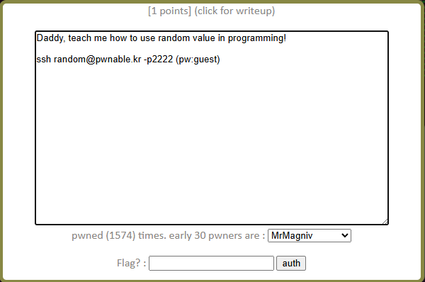

# pwnable.kr - random Writeup

This writeup covers the "random" challenge from pwnable.kr, which is a simple binary exploitation challenge that demonstrates the pitfalls of using pseudo-random number generators without proper seeding.

## The Source Code

Here is the code running on the target binary:

    #include <stdio.h>
    int main(){
        unsigned int random;
        random = rand();	// random value!

        unsigned int key=0;
        scanf("%d", &key);

        if( (key ^ random) == 0xdeadbeef ){
            printf("Good!\n");
            system("/bin/cat flag");
            return 0;
        }

        printf("Wrong, maybe you should try 2^32 cases.\n");
        return 0;
    }

## Code Analysis & Pseudo-Random Exploitation

The logic is pretty simple: the program generates a number using `rand()`, reads an integer from us via `scanf()`, and performs a bitwise XOR (`^`) comparison. If the result matches `0xdeadbeef`, it executes `system("/bin/cat flag")` and drops the flag.

The core flaw here lies in how the Pseudo-Random Number Generator (PRNG) is used:

    random = rand();

Computers can't generate true randomness out of thin air; they use mathematical formulas that require an initial starting point called a **seed**. In C, you're supposed to initialize this seed using `srand(seed)`, usually passing a changing value like `time(NULL)`. 

If a program calls `rand()` without ever setting a seed with `srand()`, the C standard library defaults the seed to **1**. Because the algorithm is purely mathematical and the seed never changes, the sequence of numbers generated by the program will be exactly identical every single time it runs.

## Doing the Math

if we run a program that calls `rand()` with the default seed of 1, we can determine the first number it will generate. In C, the first call to `rand()` with a seed of 1 produces the value:
* `random` = `1804289383` (which is `0x6B8B4567` in hex)

Now we look at the validation condition:
$$\text{key} \oplus \text{random} = \text{0xdeadbeef}$$

Bitwise XOR has a neat property: it is its own inverse. This means if $A \oplus B = C$, then $A \oplus C = B$. We can use this to rewrite the equation and isolate our required input (`key`):
$$\text{key} = \text{0xdeadbeef} \oplus \text{random}$$

Plugging in our known hex values:
$$\text{key} = \text{0xDEADBEEF} \oplus \text{0x6B8B4567}$$

If we calculate the bitwise XOR:
    
    0xdeadbeef ^ 0x6b8b4567 = 3039230856

This tells us that the decimal integer we need to pass into `scanf()` is exactly **3039230856**.

## Execution & Flag Extraction

All that's left is to SSH into the challenge server, fire up the binary, and feed it the precalculated key. 

Since `scanf("%d", &key)` expects a standard integer string, we can simply type the decimal number directly into the prompt:

    random@pwnable:~$ ./random
    3039230856
    Good!
    m0mmy_I_can_predict_rand0m_v4lue!

The binary performs the static XOR check, confirms it matches `0xdeadbeef`, and returns the flag.
